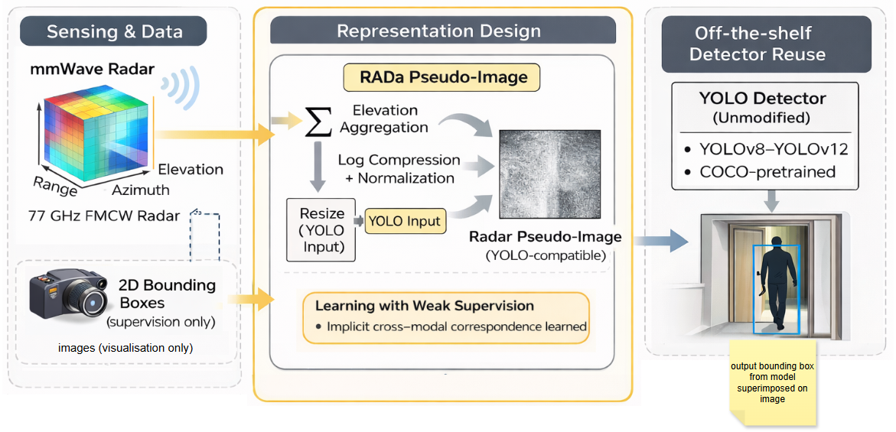
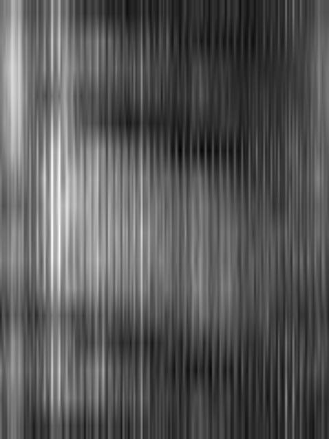
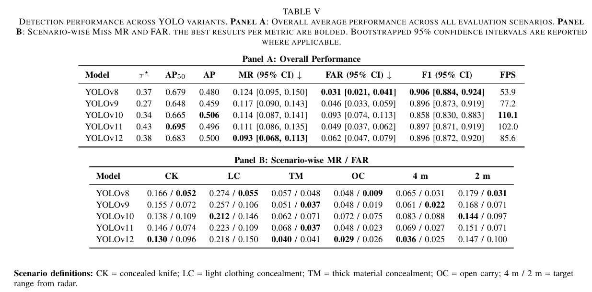

# 📡 mmw_localise  
**Radar-Based Detection Using mmWave EAR Representations and YOLO**  
*Accepted at WCCI / IJCNN 2026*

[📄 Read the paper](docs/wcci_ijcnn_2026_paper.pdf)
---

## 🔍 Overview

This project explores whether **standard vision-based object detectors (YOLO)** can be applied to **mmWave radar data** by transforming radar signals into image-like representations.

We convert **Elevation–Azimuth–Range (EAR)** tensors from a **77 GHz FMCW radar** into **2D pseudo-images**, enabling direct use of pretrained YOLO models **without architectural modification**.

The work focuses on:
- cross-modal learning (radar → vision models)  
- weak supervision using RGB annotations  
- robustness of learned signals under different conditions  
- safety-oriented evaluation (miss rate, false alarms)  

---

## 🧠 Method Overview



The pipeline:
1. Raw radar `.mat` files are processed into EAR tensors  
2. EAR tensors are converted into pseudo-images  
3. YOLO models are trained directly on these representations  
4. Predictions are evaluated using both standard and safety metrics  

---

## 📊 Radar Representation



Radar signals are converted into image-like representations:

- Elevation dimension collapsed (mean / max / sum)  
- Log compression applied  
- Resized to fixed resolution  
- Normalised and converted to 3-channel images  

This allows radar data to be treated as an **image problem**.

---

## 🧪 Detection Results



Examples of successful detections using radar-derived pseudo-images.

---

## ⚠️ Failure Cases


Failure modes include:
- missed detections under weak radar returns  
- false positives due to noise or clutter  
- sensitivity to representation quality  

---

## 🧱 Repository Structure

```
mmw_localise/
├── convert_annotations.py
├── generate_split.py
├── train_yolo_updated.py
├── test_evaluate.py
├── run_rep_ablations.py
├── label_noise_proxy.py
├── yolo_utils.py
├── config.yaml
├── config.py
├── requirements.txt
├── docs/
│   ├── fig1_pipeline.png
│   ├── fig2_representation.png
│   ├── fig3_results.png
│   ├── fig4_failures.png
└── README.md
```

---

## ⚙️ Installation

```bash
pip install -r requirements.txt
```

---

## ⚙️ Configuration

All scripts use a shared configuration file.

### Step 1 — Create config

```bash
cp config.yaml.example config.yaml
```

### Step 2 — Edit paths

```yaml
paths:
  train_root: "C:/path/to/train_data"
  test_root: "C:/path/to/test_data"
```

---

## 📂 Dataset Structure

Expected format:

```
P_X/
  P_X_S_Y/
    2D-on-2D_annotations_export.json
    color_frames_/
    Cascade_Capture_*/
      *.mat
```

After preprocessing:

```
labels_json/
ear_frames/
ra_frames/
```

---

## 🔄 Full Pipeline

---

### 1️⃣ Prepare Dataset

Convert annotations and radar data:

#### Train
```bash
python convert_annotations.py --config config.yaml --mode train
```

#### Test
```bash
python convert_annotations.py --config config.yaml --mode test
```

---

### 2️⃣ Generate Subject-Based Split

```bash
python generate_split.py --config config.yaml
```

**Important**

The split is **subject-based**, not random.

This ensures:
- no subject leakage  
- realistic evaluation  
- consistency with experimental design  

---

### 3️⃣ Train Models

```bash
python train_yolo_updated.py --config config.yaml
```

This:
- converts EAR → pseudo-images  
- trains multiple YOLO variants  
- finds optimal confidence thresholds  
- saves visualisations  

---

### 4️⃣ Evaluate Models

```bash
python test_evaluate.py --config config.yaml
```

Outputs:
- AP / AP50  
- F1 score  
- Miss Rate (MR)  
- False Alarm Rate (FAR)  
- Bootstrap confidence intervals  

---

## 🧪 Representation Ablations

```bash
python run_rep_ablations.py --config config.yaml
```

Evaluates:
- mean / max / sum aggregation  
- multi-channel representations  

---

## 📉 Label Noise Analysis

```bash
python label_noise_proxy.py --config config.yaml --mode test
```

Measures:
- radar centroid vs bounding box center  
- cross-modal misalignment  
- statistical summaries  

Outputs:
- `per_frame_metrics.csv`  
- `summary.json`  
- histogram (optional)  

---

## 🤖 Models

### Pretrained (for training)

Defined in `config.yaml`:

```yaml
models:
  yolov8: "yolov8n.pt"
  yolov9: "yolov9t.pt"
```

### Trained models (for evaluation)

```yaml
test_models:
  yolov8: "yolo_radar_runs/yolov8/weights/best.pt"
```

---

## ⬇️ Download Weights

If training from scratch, download pretrained weights:

| Model | Link |
|------|------|
| YOLOv8 | https://github.com/ultralytics/assets/releases/download/v8.4.0/yolov8n.pt |
| YOLOv9 | https://github.com/ultralytics/assets/releases/download/v8.4.0/yolov9t.pt |
| YOLOv10 | https://github.com/ultralytics/assets/releases/download/v8.4.0/yolov10n.pt |
| YOLOv11 | https://github.com/ultralytics/assets/releases/download/v8.4.0/yolo11n.pt |
| YOLOv12 | https://github.com/ultralytics/assets/releases/download/v8.4.0/yolo12n.pt |

Place in:

```
weights/
```

---

## 📊 Metrics

The evaluation pipeline reports:

- Precision / Recall  
- F1 score  
- AP / AP50  
- Miss Rate (MR) ↓  
- False Alarm Rate (FAR) ↓  
- FPS  

---

## 🧠 Key Insights

- Vision models can learn from radar representations  
- Cross-modal learning works even without calibration  
- Representation choice significantly impacts performance  
- Safety metrics reveal behaviour not captured by AP  

---

## ⚠️ Limitations

- Small dataset  
- Weak supervision (RGB → radar)  
- No explicit sensor calibration  
- Representation loses some geometric structure  

---

## 📜 License

MIT License

---

## 👤 Author

Ogonna Okafor  
📧 ogonnaokafor584@gmail.com  

---

## 🚀 Notes

Before running:

- update `config.yaml`  
- download pretrained weights  
- ensure dataset structure is correct  

Recommended `.gitignore`:

```
yolo_radar_runs/
ablation_runs/
*.pt
config.yaml
```

---

## 🔥 Summary

This repository provides a complete pipeline for:

- radar preprocessing  
- representation learning  
- model training  
- evaluation  
- analysis  

All experiments are reproducible via a unified configuration system.
